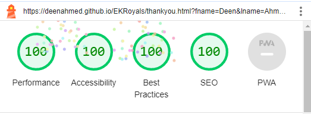

# EKRoyals

Brand new website for a local Basketball Club in East Kilbride, with training, coaching and tournmanets available for young people between the year groups of S1-S6.

[Live webpage](https://deenahmed.github.io/EKRoyals/)

## Aim of the site

The client has stated they wanted a new website to be able to showcase an overview of their club and have asked for this to be designed to the following specifications;

A website to showcase the offerings of a Youth Basketball Club based in East Kilbride, Glasgow.
The primary aim of the website is to showcase the Club and what activities they offer.

The club chairman and group have provided me with the following goals for the site.

1. A simple but professional design.
2. A space to show the age group training days.
3. A space to show the many tournaments they have.
4. A form to allow users to sign up for tournaments.

## UX

As the club is fairly established in their local town, the main aim is to grow the clubs members and exposure throughout the local authority.

### Target audience

- Young People with interest in basketball.
- Parents or guardians looking for an activity for their young family.

### User requirements and expectations

- A clear navigation that makes it easy to see what information is available on the site.
- Links and functions that work as expected.
- Consistency across pages.
- Fully responsive for viewing on any device.

## Design

I came up with the following keywords for the site:

- Welcoming
- Modern
- Simplistic
- User friendly

### Fonts

The classic font "Arial" is used throughout the whole site. I chose to use this as it is bold and easy to read against an imaged background.

### Background

All the pages have the same background, I went for a simple image of a basketball and a team playing in the back. I used this because it intrigues the user and gives the site a modern look.

## Features

### Title and Navigation

The page title, navigation and social media links are shown at the top of every page. They're fully responsive.

### Home

The Home page has a brief overview of the club and what they do. Along with a button that links to the contact page.

### Training

A breakdown of the training days and locations for the different age groups.

### Tournaments

A showcase of the different tournaments available, indoor and outdoor. Along with a button that takes you to the sign up page.

### Contact Us

A contact details page with email and mobile links. A map to the main training facility.

### Sign-Up

A sign up form that allows users to sign up for tournaments or training.

### Thank you

After submitting the form, users are redirected to a form submission page. This page says thank you, with a short explanation of the expected time for a response.

### 404

If a user comes across a page that doesn't exist on the site, they will be redirected to a 404 page.

## Technologies used

- HTML & CSS programming languages
- [Font Awesome](https://fontawesome.com/) - Social Media Logos
- [VSCode](https://code.visualstudio.com/) - IDE for local developement
- [GIT](https://git-scm.com/) - Version Control
- [GitHub](https://github.com/) - To host the repositories for this project and the live website preview
- [W3C Markup Validation](https://validator.w3.org/) - Validate HTML
- [W3C CSS validation](https://jigsaw.w3.org/css-validator/) - Validate CSS
- [Lighthouse Chrome](https://chrome.google.com/webstore/detail/lighthouse/blipmdconlkpinefehnmjammfjpmpbjk?hl=en) - To audit best security practice and reduce loading times

## Validation

### HTML validation

The [W3C Markup Validation Service](https://validator.w3.org/) was used to validate the HTML of the website. All pages pass with 0 errors and 0 warnings.

Home page

Training page

Tournaments page

Contact Us page

Sign Up page

Thankyou page

404 page

### CSS validation

The [W3C Jigsaw CSS Validation Service](https://jigsaw.w3.org/css-validator/) was used to validate the CSS of the website. The CSS passes with 0 errors.

style.css

### Performance

[Google Lighthouse](https://developers.google.com/web/tools/lighthouse) was used to test the performance of the website.

Home page

Training page

Tournaments page

Contact Us page

Sign Up page

Thank you page

404 page

### Performing tests on various devices

The website was tested on the following devices:

- Lenovo ideaPad,
- HP elitebook
- iPhone 12 Pro, iPhone SE

### Browser compatability

The website was tested on the following browsers:

- Microsoft Edge
- Google Chrome

## Deployment

The website was deployed using GitHub Pages by following these steps:

1. In the GitHub repository navigate to the Settings tab
2. On the left side menu select Pages
3. For the source select Branch: master
4. Once the webpage refreshes you will see a bar on the top with the following message: "Your site is published at"

You can clone the repository by following these steps:

1. Go to the GitHub repository
2. Find the Code button located above the list of files and click it
3. Select if you prefer to clone using HTTPS, SSH, or Github CLI and click copy this will copy the URL to your clipboard
4. Open Git Bash
5. Change the current working directory to where you want the cloned directory
6. Type git clone and paste the URL from the clipboard ($ git clone https://github.com/YOUR-USERNAME/YOUR-REPOSITORY)
7. Press Enter to create your local clone.

## Credits

### Media

Pexels was used for the background of the site. The license is copyright-free.

- [Pexels](https://www.pexels.com/)

For the icons:

- [Font Awesome](https://fontawesome.com)

### Other

## Acknowledgements

I would like to take the opportunity to thank:

- My friends and work colleagues for their advice, support and help with testing.
- My mentor [Richard Wells](https://github.com/D0nni387) for his first class support.
