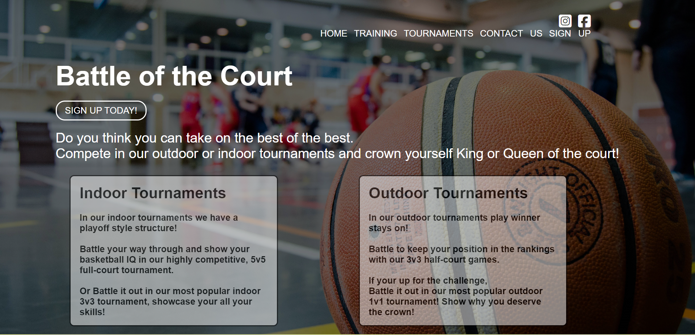
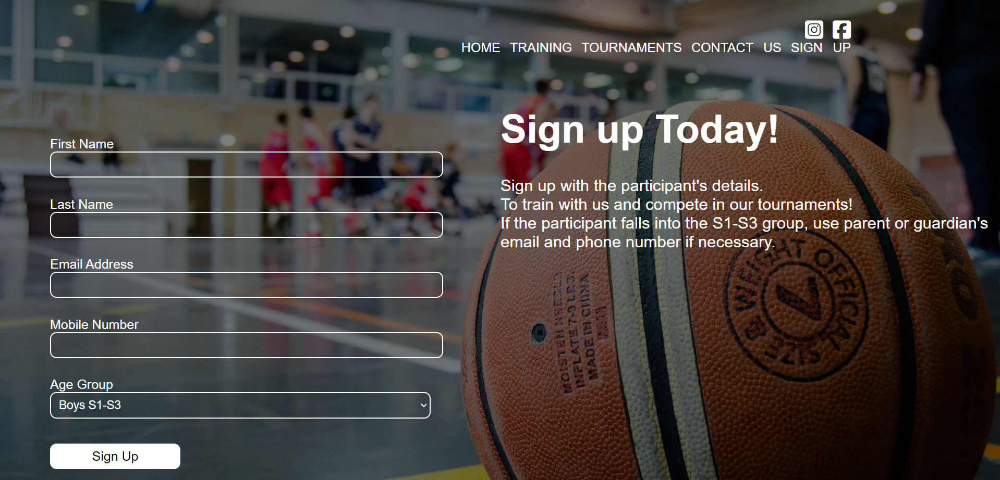
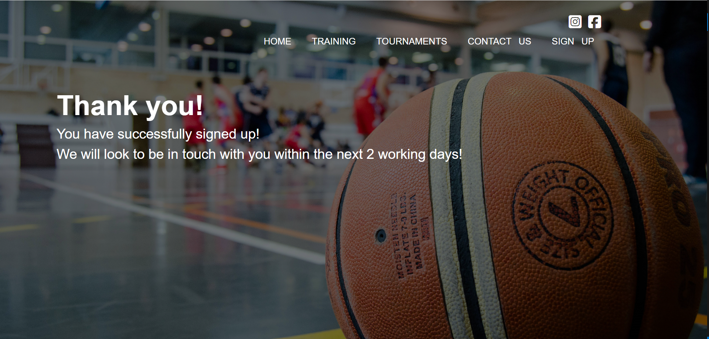

# EKRoyals

Brand new website for a local Basketball Club in East Kilbride, with training and tournmanets available for young people between the year groups of S1-S6.

[Live webpage](https://deenahmed.github.io/EKRoyals/)

## Aim of the site

The client has stated they they wanted a new website to be able to showcase an overview of their club and have asked for this to be designed to the following specifications;

A website to showcase the offerings of a Youth Basketball Club based in East Kilbride, Glasgow.
The primary aim of the website is to showcase the Club and what they offer.

The club chairman and group have provided me with the following goals for the site.

1. A simple but professional design.
2. A space to show the age group training days.
3. A space to show the many tournaments they have.
4. A form to allow users to sign up for tournaments.

## UX

As the club is fairly established in their local town, the main aim is to grow the clubs members and exposure throughout the local authority.

### Target audience

- Young People with interest in bsketball.
- Parents or guardians looking for an activity for their young family.

### User requirements and expectations

- A clear navigation that makes it easy to see what information is available on the site.
- Links and functions that work as expected.
- Consistency across pages.
- Fully responsive for viewing on any device.

## Design

I came up with the following keywords for the brand:

- Welcoming
- Modern
- Simplistic
- User friendly

### Fonts

The classic font "Arial" is used throughout the whole site. I chose to use this as it is bold and easy to read against a imaged background.

### Background

All the pages have the same backhground, i went for a simple image of a basketball and a team playing in the back. I used this because it intigues the user and gives the site a morden look.

## Features

### Title and Navigation

The page title and navigation is shown at the top of every page. They're fully responsive.

### Home

The Home page has a brief overview of the club and what they do. Along with a button that links to the contact page.

### Training

A breakdown of the training days and locations for the different age groups.

### Tournaments

A showcase of the different tournaments available, indoor and outdoor.

### Contact Us

A contact details page with email and mobile links. A map to the main training facility.

### Sign-Up

A sign up form that allows users to sign up for tournaments or training.

### Thank you

After submitting the form, users are redirected to a form submission page. This page says thank you, with a short explanation of the expected time for a response.

### 404

If a user comes across a page that doesn't exist on the site, they will be redirected to a 404 page.

## Technologies used

- HTML & CSS programming languages
- [Font Awesome](https://fontawesome.com/) - Social Media Logos
- [VSCode](https://code.visualstudio.com/) - IDE for local developement
- [GIT](https://git-scm.com/) - Version Control
- [GitHub](https://github.com/) - To host the repositories for this project and the live website preview
- [W3C Markup Validation](https://validator.w3.org/) - Validate HTML
- [W3C CSS validation](https://jigsaw.w3.org/css-validator/) - Validate CSS
- [Lighthouse Chrome](https://chrome.google.com/webstore/detail/lighthouse/blipmdconlkpinefehnmjammfjpmpbjk?hl=en) - To audit best security practice and reduce loading times

## Validation

### HTML validation

The [W3C Markup Validation Service](https://validator.w3.org/) was used to validate the HTML of the website. All pages pass with 0 errors and 0 warnings.

Home page

Training page

Tournaments page

Contact Us page

Sign Up page

Thankyou page

404 page

### CSS validation

The [W3C Jigsaw CSS Validation Service](https://jigsaw.w3.org/css-validator/) was used to validate the CSS of the website. The CSS passes with 0 errors. There are some warnings due to using CSS variables (custom properties), which the validator does not support yet. See the [CSS Validator's GitHub](https://github.com/w3c/css-validator/pull/173#issuecomment-878349650) for more information.

style.css

### Performance

[Google Lighthouse](https://developers.google.com/web/tools/lighthouse) was used to test the performance of the website.

Home page

Pricing page

Gallery page

Contact page

Form submission page

404 page

### Performing tests on various devices

The website was tested on the following devices:

- Apple MacBook Pro, Apple MacBook Air
- iPhone X, iPhone 8, iPhone SE
- Huawei P30 Pro

### Browser compatability

The website was tested on the following browsers:

- Microsoft Edge
- Google Chrome
- Firefox
- Safari: An odd issue with the first FAQ item where the white background has chunks missing. Also, the map takes up more space on the contact page.

## Bugs

| **Bug**                                                                        | **Fix**                                                   |
| ------------------------------------------------------------------------------ | --------------------------------------------------------- |
| Button hover states aren't working correctly                                   | Move `.button` class from the `<li>` to the `<a>` element |
| Logo image sits above logo after adding mobile navigation                      | Move it to inside the logo's `<li>` element.              |
| Logo breaks into two lines on smaller screens                                  | Reduce the font size for smaller screens                  |
| FAQ items are not using the full width available                               | Remove width restriction from FAQ answer `
` elements   |
| Pricing cards are not spaced correctly                                         | Reduce padding on the cards and add a width of 32%        |
| Map is not responsive                                                          | Remove width and height from the iframe and add extra CSS |
| Safari shows triangles for `
` tag, even though it's hidden in the CSS | Set `summary::-webkit-details-marker` to `display: none;` |
| Mobile menu toggle causes accessibility checker to fail                        | Give the link an `aria-label`                             |

## Deployment

The website was deployed using GitHub Pages by following these steps:

1. In the GitHub repository navigate to the Settings tab
2. On the left hand menu select Pages
3. For the source select Branch: master
4. After the webpage refreshes automaticaly you will se a ribbon on the top saying: "Your site is published at..."

You can for fork the repository by following these steps:

1. Go to the GitHub repository
2. Click on Fork button in upper right hand corner

You can clone the repository by following these steps:

1. Go to the GitHub repository
2. Locate the Code button above the list of files and click it
3. Select if you prefere to clone using HTTPS, SSH, or Github CLI and click the copy button to copy the URL to your clipboard
4. Open Git Bash
5. Change the current working directory to the one where you want the cloned directory
6. Type git clone and paste the URL from the clipboard ($ git clone https://github.com/YOUR-USERNAME/YOUR-REPOSITORY)
7. Press Enter to create your local clone.

## Credits

### Media

Unsplash was used for all photos throughout the site. The license is copyright-free.
In order of apearance:

- Woman sitting by a window (hero) - [Brooke Cagle](https://unsplash.com/photos/NoRsyXmHGpI)
- Smiling man (hero testimonial) - [Ben Parker](https://unsplash.com/photos/OhKElOkQ3RE)
- Female software engineer (first testimonial) - [ThisisEngineering](https://unsplash.com/photos/69wEv-G2W_s)
- Person holding phone (second testimonial) - [Austin Distel](https://unsplash.com/photos/qgdJX9mvMJI)
- Woman using laptop (gallery) - [Brooke Cagle](https://unsplash.com/photos/xcgh5_-QIXc)
- Coworking office space (gallery) - [Andrea Davis](https://unsplash.com/photos/04G19lnpHcc)
- Home interior design (gallery) - [Andrea Davis](https://unsplash.com/photos/w-ARisGf_Kw)
- Coworking office space (gallery) - [CoWomen](https://unsplash.com/photos/XRGzgDmfjdw)
- People standing on grey tiles (gallery) - [Ian Schneider](https://unsplash.com/photos/TamMbr4okv4)
- Empty restaurant (gallery) - [Mengyi](https://unsplash.com/photos/CBGuFZoC6Mw)
- Three people around a table (gallery) - [Brooke Cagle](https://unsplash.com/photos/g1Kr4Ozfoac)
- Office desk space (gallery) - [Andrea Davis](https://unsplash.com/photos/GtqN1cTGocE)
- WeWork Richmond (gallery) - [Eloise Ambursley](https://unsplash.com/photos/iRZqkdb8gK8)

For the illustrations:

- [Figma Community - Indian Doodle Pack](https://www.figma.com/community/file/892381006526736549)

For the icons:

- [Phosphoricons](https://phosphoricons.com/)

### Other

- [Namelix](https://namelix.com/app/?keywords=creative+technology) - startup name generator for testimonials
- [Testimonial generator](https://testimonial-generator.com/index.php) - for testimonials

## Acknowledgements

I would like to take the opportunity to thank:

- My family, friends and colleagues for their advice, support and help with testing.
- My mentor Mo Shami for their feedback, advice and support.
- Code Institute Slack for peer reviews and advice.
